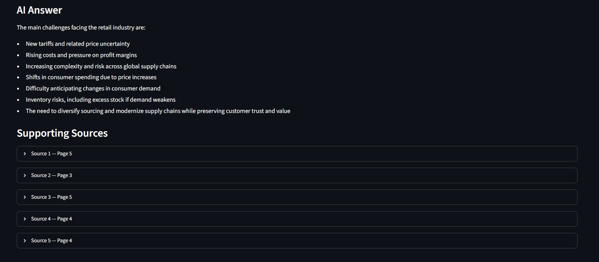

# AI-Powered Retail Report Analysis with RAG

## Demo

The Streamlit application allows users to upload a retail industry report, ask business questions, and inspect the supporting source passages retrieved by the RAG pipeline.

## Overview

This project develops and evaluates a **Retrieval-Augmented Generation (RAG)** system for analyzing retail industry reports.

Using a **2025 Deloitte retail and consumer trends report** as the primary case study, the system retrieves relevant evidence from the report and uses a language model to generate document-grounded answers to business questions.

The project also evaluates how different RAG configurations affect retrieval relevance, answer quality, and source grounding.

## Business Problem

Retail industry reports contain valuable insights about market trends, consumer behavior, cost pressures, and business strategies. However, manually reviewing lengthy reports and locating relevant evidence can be time-consuming.

This project explores how RAG can help analysts retrieve relevant information more efficiently and generate evidence-based answers while maintaining traceability to the original source.

## RAG Pipeline

The project implements the following workflow:

1. Load the retail report using `PyPDFLoader`
2. Split the document into text chunks
3. Generate embeddings using OpenAI embeddings
4. Store document vectors in a FAISS vector database
5. Retrieve relevant chunks using semantic similarity search
6. Provide retrieved evidence to a language model
7. Generate document-grounded answers
8. Evaluate retrieval and answer quality

### Retrieval Improvement

To improve retrieval quality, the application retrieves a larger candidate set before constructing the final context:

1. Retrieve the top 8 candidate chunks using semantic similarity.
2. Remove low-information chunks containing fewer than 100 characters.
3. Keep the top 5 remaining chunks for the final LLM context.

This reduces retrieval noise while preserving relevant evidence for answer generation.

## Technologies

* Python
* LangChain
* OpenAI API
* OpenAI Embeddings
* FAISS
* Pandas
* Streamlit
* Jupyter Notebook

## Experiments

The project evaluates multiple RAG configurations by varying:

* **Chunk size:** 500, 800, and 1100 characters
* **Top-K retrieval:** 3 and 5
* **Chunk overlap:** 150 characters

Answer quality is manually evaluated based on:

* Relevance
* Completeness
* Grounding

Retrieval quality is also evaluated using **Relevant Chunk Rate**.

## Key Result

Among the six tested retrieval configurations, **500-character chunks with Top-K = 5 achieved the highest manual answer-quality score of 9.0/9.0**.

The experiment also showed that retrieval precision and final answer quality are related but distinct. For example, the 800-character / Top-K 5 configuration achieved a higher Relevant Chunk Rate, while the 500-character / Top-K 5 configuration produced better overall answer quality.

This suggests that RAG performance depends on the interaction between chunk size, retrieval depth, and evidence coverage rather than any single parameter.

## Additional Experiments

The project also investigates:

* Document cleaning to reduce retrieval noise
* The effect of non-substantive report sections on retrieval
* RAG-generated answers compared with a baseline LLM without document retrieval

## Project File

`RAG_Retail_Report_Analysis.ipynb` — Main notebook containing the complete RAG pipeline, experiments, evaluation, and business analysis.

## Purpose

This project demonstrates how Retrieval-Augmented Generation can be applied to business report analysis while emphasizing retrieval quality, source grounding, experimental evaluation, and practical business insights.
